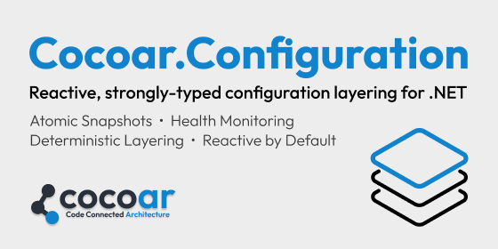

# Reactive, strongly-typed configuration layering for .NET



[](LICENSE)
[](https://www.nuget.org/packages/Cocoar.Configuration/)
[](https://www.nuget.org/packages/Cocoar.Configuration/)

Zero ceremony configuration that updates itself. Define a class, add a rule, inject it — no `IOptions<T>` wrappers, no `Configure<T>()` calls.

## Install

```shell
dotnet add package Cocoar.Configuration              # Core library (console apps)
dotnet add package Cocoar.Configuration.DI            # + Microsoft.Extensions.DI
dotnet add package Cocoar.Configuration.AspNetCore     # + health endpoints, feature flags
```

You only need **one** — each includes everything above it. Requires .NET 8+.

## Quick Start

```csharp
var builder = WebApplication.CreateBuilder(args);

builder.AddCocoarConfiguration(c => c
    .UseConfiguration(rule => [
        rule.For<AppSettings>().FromFile("appsettings.json"),
        rule.For<AppSettings>().FromEnvironment("APP_"),
    ]));

var app = builder.Build();

// Inject directly — no wrapper
app.MapGet("/settings", (AppSettings settings) => new
{
    settings.AppName,
    settings.MaxRetries
});

app.Run();
```

## Key Features

- **Zero Ceremony** — Define a class, add a rule, inject it. Just your POCO.
- **Reactive by Default** — `IReactiveConfig<T>` updates automatically when sources change.
- **Atomic Updates** — `IReactiveConfig<(T1, T2)>` guarantees consistent snapshots across types.
- **Explicit Layering** — Rules execute in order, last write wins. File, environment, CLI, HTTP.
- **Memory-Safe Secrets** — `Secret<T>` with automatic zeroization and X.509 hybrid encryption.
- **Feature Flags & Entitlements** — Strongly-typed, source-generated, with expiry health monitoring.
- **Multi-Tenant** — The same config type resolves per tenant on a shared global base; `.TenantScoped()` rules, `…ForTenant(id)` access.
- **DI-Aware Providers** — Opt-in Layer-2 rules whose providers use `IHttpClientFactory` / Marten / EF, without giving up the no-DI core.
- **Health Monitoring** — Per-rule status tracking, OpenTelemetry metrics, ASP.NET Core health checks.
- **Compile-Time Validation** — Roslyn analyzers catch configuration errors in your IDE.
- **First-Class Testing** — `CocoarTestConfiguration` with `AsyncLocal<T>` isolation.

## Providers

| Provider | Fluent API | Package |
|----------|-----------|---------|
| File (JSON) | `.FromFile("path")` | Core |
| Environment Variables | `.FromEnvironment("PREFIX_")` | Core |
| Command Line | `.FromCommandLine("--prefix")` | Core |
| Static / Observable | `.FromStaticJson()` / `.FromObservable()` | Core |
| LocalStorage (writable overlay) | `.FromLocalStorage()` | Core |
| HTTP | `.FromHttp(url)` | [Http](https://www.nuget.org/packages/Cocoar.Configuration.Http) |
| Microsoft IConfiguration | `.FromIConfiguration(config)` | [MicrosoftAdapter](https://www.nuget.org/packages/Cocoar.Configuration.MicrosoftAdapter) |

## Examples

Explore real-world scenarios in the [examples](src/Examples/) directory.

## Contributing

Contributions welcome! See [CONTRIBUTING.md](CONTRIBUTING.md) for guidelines.

## License

[Apache-2.0](LICENSE) — see [NOTICE](NOTICE) for details.
