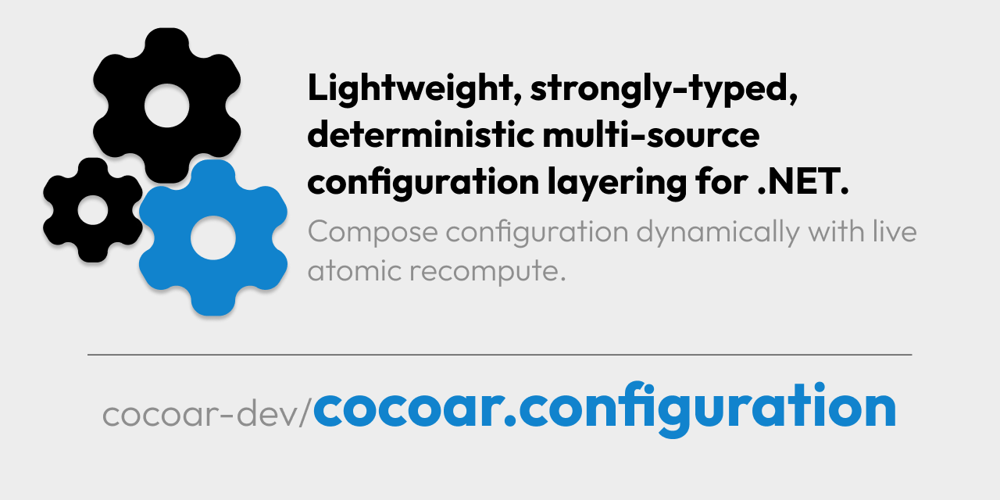

# Cocoar.Configuration

<p align="left">
        
</p>

Lightweight, strongly-typed configuration aggregation for .NET (current target framework: **net9.0**).

<!-- Badges (NuGet placeholder until published) -->


<!-- Future: NuGet badge once package is public -->
<!--  -->

> **At a glance**
> * Layer multiple sources (files, environment variables, HTTP, adapters) with deterministic **last‑write‑wins** merge
> * Providers return JSON objects; some emit change signals for live updates
> * On any change a full ordered recompute occurs; result swap is atomic
> * Direct DI access to your config types (no required `IConfiguration` / `IOptions` wrappers)

---

## Supported Framework & Packages (Current State)

Currently only **net9.0** is built. Multi-targeting can be added later.

| Package | Description | TFM (current) |
|---------|-------------|---------------|
| `Cocoar.Configuration` | Core (File + Environment providers, merge orchestration) | net9.0 |
| `Cocoar.Configuration.AspNetCore` | WebApplicationBuilder / DI convenience | net9.0 |
| `Cocoar.Configuration.HttpPolling` | HTTP polling provider | net9.0 |
| `Cocoar.Configuration.MicrosoftAdapter` | Adapter for Microsoft IConfigurationSource | net9.0 |

### Install (Example)
```xml
<ItemGroup>
        <PackageReference Include="Cocoar.Configuration" />
        <!-- Optional extensions -->
        <PackageReference Include="Cocoar.Configuration.AspNetCore" />
        <PackageReference Include="Cocoar.Configuration.HttpPolling" />
        <PackageReference Include="Cocoar.Configuration.MicrosoftAdapter" />
</ItemGroup>
```

Quick CLI install commands:
```
dotnet add package Cocoar.Configuration
dotnet add package Cocoar.Configuration.AspNetCore
dotnet add package Cocoar.Configuration.HttpPolling
dotnet add package Cocoar.Configuration.MicrosoftAdapter
```

---

## Quick Start
Minimal example (file + environment layering, strongly-typed access):

```csharp
using Cocoar.Configuration;
using Cocoar.Configuration.AspNetCore;
using Cocoar.Configuration.Providers.FileSourceProvider.Fluent;
using Cocoar.Configuration.Providers.EnvironmentVariableProvider.Fluent;

public class AppSettings
{
        public string ConnectionString { get; set; } = "";  // base value in JSON, can be overridden
        public bool EnableFeatureX { get; set; }             // overridden by env var APP_EnableFeatureX
        public int CacheSeconds { get; set; } = 30;          // overridden by env var APP_CacheSeconds
}

var builder = WebApplication.CreateBuilder(args);

builder.AddCocoarConfiguration(
        // Base layer (optional): read a section from a JSON file if it exists
        Rule.From.File(_ => FileSourceRuleOptions.FromFilePath("appsettings.json", "App"))
                .For<AppSettings>().Optional(),

        // Environment variables (prefix APP_) override matching properties
        Rule.From.Environment(_ => new EnvironmentVariableRuleOptions("APP_"))
                .For<AppSettings>()
);

var app = builder.Build();

// Resolve the manager and get a typed snapshot (throws if missing)
var settings = app.Services
        .GetRequiredService<ConfigManager>()
        .GetRequiredConfig<AppSettings>();

Console.WriteLine($"FeatureX: {settings.EnableFeatureX}, Cache: {settings.CacheSeconds}s");
```

Example overlay (JSON + environment):
```
appsettings.json (optional):
{
    "App": {
        "ConnectionString": "Server=localhost;Database=MyApp;",
        "EnableFeatureX": false,
        "CacheSeconds": 30
    }
}

Environment variables:
APP_EnableFeatureX=true
APP_CacheSeconds=60
```

More examples (multi-project solution under `src/Examples/`):

- **[BasicUsage](src/Examples/BasicUsage/Program.cs)** – File + environment layering pattern (full code)
- **[AspNetCoreExample](src/Examples/AspNetCoreExample/Program.cs)** – Web application integration
- **[FileLayering](src/Examples/FileLayering/Program.cs)** – Multiple JSON layers (deterministic last-write-wins)
- **[ServiceLifetimes](src/Examples/ServiceLifetimes/Program.cs)** – DI lifetimes + keyed registrations
- **[DynamicDependencies](src/Examples/DynamicDependencies/Program.cs)** – Rules reading other config mid-recompute
- **[GenericProviderAPI](src/Examples/GenericProviderAPI/Program.cs)** – Full generic provider control
- **[MicrosoftAdapterExample](src/Examples/MicrosoftAdapterExample/Program.cs)** – Integrate any `IConfigurationSource`
- **[HttpPollingExample](src/Examples/HttpPollingExample/Program.cs)** – Remote polling with change detection
- **[StaticProviderExample](src/Examples/StaticProviderExample/Program.cs)** – Seeding & composition with static rules

Open the solution: [`src/Examples/Examples.sln`](src/Examples/Examples.sln) or run an example directly, e.g.:
```
dotnet run --project src/Examples/BasicUsage
```

---

## Core Model (Rules, Providers, Merge, Dynamic)

- **Rule**: Defines source + query + target configuration type
- **Provider**: Returns a JSON object (optionally emits change signals)
- **Merge**: Flatten (`Section:Key`) → last-write-wins per key → unflatten → bind to target type
- **Arrays**: Full replacement (no element-wise merge)
- **Recompute**: Any change signal triggers full rebuild of all rules in declared order (simple & correct, not minimal)
- **Dynamic dependencies**: Factories (options/query) may read in-progress snapshots (order matters)
- **Required vs Optional**: Required failures block the type; optional failures skip that rule
- **DI Lifetimes & Keyed Services**: Register as Singleton (default), Scoped or Transient (with optional service keys)

### Static Provider

See [`src/Examples/StaticProviderExample/Program.cs`](src/Examples/StaticProviderExample/Program.cs) for seeding defaults and composing dependent configuration.

---

## Advanced Features

### Service Lifetimes & Keyed Services
Control how configuration types are registered in DI container. Default is Singleton, but you can specify Scoped/Transient and use keyed services for multiple configurations of the same type.
→ Example: [`src/Examples/ServiceLifetimes/Program.cs`](src/Examples/ServiceLifetimes/Program.cs)

### Generic Provider API  
Use `Rule.From.Provider<TProvider, TOptions, TQuery>()` for full control over any provider type, including third-party providers.
→ Example: [`src/Examples/GenericProviderAPI/Program.cs`](src/Examples/GenericProviderAPI/Program.cs)

### Microsoft Configuration Adapter
Plug any Microsoft `IConfigurationSource` (JSON, XML, Key Vault, User Secrets, etc.) into Cocoar's rule-based system.
→ Example: [`src/Examples/MicrosoftAdapterExample/Program.cs`](src/Examples/MicrosoftAdapterExample/Program.cs)

### HTTP Polling Provider
Fetch configuration from HTTP endpoints with automatic polling. Only triggers recomputes when response actually changes.
→ Example: [`src/Examples/HttpPollingExample/Program.cs`](src/Examples/HttpPollingExample/Program.cs)

## Providers (Overview)

| Provider | Package | Change Signal | Notes |
|----------|---------|---------------|-------|
| **File (JSON)** | Core | ✅ Filesystem watcher (debounced) | Paths/sections; good base layer |
| **Environment** | Core | ❌ Snapshot only | Prefix filter; `__` & `:` nesting |
| **HTTP Polling** | Extension | ✅ On real payload change | Optional headers; polling interval |
| **Microsoft Adapter** | Extension | Depends on source | Wrap any `IConfigurationSource` |

**All providers support:** Optional/required rules, dynamic factories, provider instance pooling.

**Provider Documentation:**
- [File Provider](src/Cocoar.Configuration/Providers/FileSourceProvider/README.md) - JSON files with filesystem watching
- [Environment Provider](src/Cocoar.Configuration/Providers/EnvironmentVariableProvider/README.md) - Environment variables with prefix filtering  
- [HTTP Polling Provider](src/Cocoar.Configuration.HttpPolling/README.md) - HTTP endpoint polling _(separate package)_
- [Microsoft Adapter](src/Cocoar.Configuration.MicrosoftAdapter/README.md) - IConfigurationSource integration _(separate package)_

## API Overview

**ConfigManager**
| Method | Behavior |
|--------|----------|
| `GetConfig<T>()` | Snapshot or null; never throws |
| `GetRequiredConfig<T>()` | Snapshot or exception if missing |
| `TryGetConfig<T>(out T?)` | true + value if available; else false/null |
| `GetConfigAsJson(Type)` | Merged JSON (or null) |

**Rule Creation (Fluent)**
| Entry | Description |
|-------|-------------|
| `Rule.From.File(...)` | JSON files (watcher + debounce) |
| `Rule.From.Environment(...)` | Environment snapshot (optional prefix) |
| `Rule.From.Http(...)` | (Extension) polling with change detection |
| `Rule.From.Provider<TProv,TOpt,TQuery>(...)` | Generic provider entry point |
| `Rule.From.Static(...)` | Static object (seeding / defaults) |

Semantics: Use Optional for non-critical layers; Required enforces presence.

## Extensibility (Third-Party Providers)

Cocoar.Configuration is designed to be extensible. Third-party packages can add their own fluent entry points (like `Rule.From.MyProvider()`) without modifying the core library.

**For provider developers:** See the [Provider Development Guide](src/Cocoar.Configuration/Providers/README.md) for complete documentation on:
- Implementing custom providers with the `ConfigSourceProvider<TInstanceOptions,TQueryOptions>` base class
- Creating fluent extension methods for your provider
- Provider lifecycle management and change emission patterns
- Testing strategies and best practices

**For users:** Simply install third-party provider packages and use their fluent APIs alongside the built-in providers.

---

---

## Security

* **Never commit secrets** to JSON files in your repository  
* Use **environment variable overlays** or dedicated secret management systems  
* For remote providers: Always use **TLS**, set reasonable **timeouts**, and include **auth headers** when needed  
* Consider using Azure Key Vault, AWS Secrets Manager, or similar via the **Microsoft Adapter**

---

## Examples (Overview)

Multi-project examples live under [`src/Examples/`](src/Examples/) (see [`src/Examples/README.md`](src/Examples/README.md)). Each folder is a runnable console (or minimal) project with its own `Program.cs`:

### Core Examples
- `BasicUsage` – File + environment layering
- `AspNetCoreExample` – Web app integration
- `FileLayering` – Multi-file deterministic layering

### Advanced Configuration
- `ServiceLifetimes` – DI lifetimes & keyed registrations
- `DynamicDependencies` – Reading prior config during recompute

### Provider Extensions
- `GenericProviderAPI` – Generic provider composition
- `MicrosoftAdapterExample` – Adapting `IConfigurationSource`
- `HttpPollingExample` – Remote polling with change detection
- `StaticProviderExample` – Static seeding & dependent composition

Run any example:
```
dotnet run --project src/Examples/GenericProviderAPI
```

> **Quality Assurance**: The examples solution ([`src/Examples/Examples.sln`](src/Examples/Examples.sln)) is built in CI to ensure examples stay aligned with the API. Functional behaviors are additionally covered by unit/integration tests.

---

## Thread Safety & Performance

- **Thread-safety**: Reading configuration is thread-safe. Recompute produces a new snapshot and swaps atomically.
- **Recompute cost**: Full merge of all rules (O(n) w.r.t. rule count + JSON size). Partial recompute is on the roadmap.
- **Provider reuse**: Instances reused while instance options remain stable; query changes rebuild subscriptions.

---

## How It Works (Detail)

- You define rules. Each rule targets a specific config type (class/interface) and queries exactly one provider to produce a JSON object.
- For a given type T, Cocoar starts from T's defaults and merges each rule's JSON into T in the configured order (last-write-wins, key-by-key).
- During a recompute, a rule can read the current in-progress snapshot from the ConfigManager (any type). This enables dynamic rules whose options depend on values produced by earlier rules in the same recompute.
- Objects are flattened into colon-keys (e.g., `Section:Enabled`), merged in order, then unflattened and deserialized into your target type.

### Change model and recompute

- Providers may emit change notifications (e.g., file watcher, HTTP polling). The environment provider typically does not emit by default and is treated as snapshot input.
- On any provider change, Cocoar recomputes all rules for all target types in order and atomically swaps the cache. Consumers see consistent snapshots.
- If your rule factories (options/query) depend on current config, provider instances/subscriptions are rebuilt during recompute so dynamic dependencies take effect.

### Required vs optional rules

- Each rule can be marked required or optional.
- Required: failures (e.g., missing file, HTTP error) cause the recompute to fail for that rule/type.
- Optional: failures are tolerated and the rule is skipped for that recompute.

### Ordering and dependencies

- Place dependency-producing rules before dependency-consuming rules.
- Rules may read any type's current snapshot during recompute. Avoid circular dependencies across types or rules to prevent surprises.

**Guidance for recompute-time reads:**
- GetRequiredConfig<T>() throws if T does not exist yet; use only if you guarantee T is produced earlier.
- GetConfig<T>() returns null if T does not exist; handle nulls explicitly when reading dependencies.
- For guaranteed existence, seed the dependency type with an explicit rule (e.g., a static provider/factory rule — see `Rule.From.Static`).

### Merge semantics and limits

- Last-write-wins, key-by-key merge of JSON objects using colon-key flattening.
- Arrays are replace-only by design; an array value replaces the prior value at that key (no merging).
- Keys follow `Section:Key` flattening during merge; final objects are unflattened before binding to your types.

---

## Versioning & Stability

- Stable releases follow **SemVer**; see GitHub Releases or NuGet version history for changes.
- Breaking changes only in MAJOR versions; MINOR for additive features; PATCH for fixes.
- Provider abstractions evolve conservatively.

> Packages are published under the NuGet organization **cocoar**.

---

## Contributing

Issues and PRs welcome. Please keep provider abstractions stable and deterministic (e.g., option keys for instance pooling) and follow the merge semantics described in ARCHITECTURE.md.

**📝 Documentation Quality**: Projects under [`src/Examples/`](src/Examples/) are built in CI to ensure they remain in sync with the current API. Keep examples minimal and idiomatic when contributing.

---

For deeper details, examples, and roadmap, check src/Cocoar.Configuration/README.md and ARCHITECTURE.md.

---

## Current Limitations (Current State)

**Recompute model:** On any change emission, the manager recomputes all rules from scratch in order (last-write-wins merge). This is simple and correct but not minimal; a future optimization could recompute only affected rules downstream from the changed provider.

**Provider lifecycle:** Managed by an internal `RuleManager` per rule which reuses providers when instance options don't change and rebuilds subscriptions when query options change. This enables dynamic factories without recreating instances unnecessarily.

**Array merge semantics:** Arrays are replaced completely (not merged element-wise). Objects are flattened to colon keys and merged key-by-key. Additional array strategies (append/merge/custom) are under consideration.

**Null/empty handling:** Edge cases (nulls and empty objects) follow JSON deserialization defaults after key merge. Precise behavior will be documented as the API stabilizes.

**Change emissions:** Environment provider does not emit changes by default (snapshot only). File provider emits on filesystem changes. If you need change-driven recompute for environment variables, combine with other providers that do emit.

**Circular dependencies:** Rules can read any type's current snapshot during recompute via `GetConfig<T>()` calls in options/query factories. Avoid circular dependencies across types; detection/guardrails may be added.

**DI lifetimes:** Configuration types are registered as singletons by default. Support for scoped/transient lifetimes exists but may evolve.

---

## Roadmap (Short)

- **Partial recompute:** Only recompute rules downstream from changed providers to reduce work on frequent changes
- **Provider pooling:** Better lifecycle reuse across recomputes with `IDisposable` support for long-lived connections  
- **Array merge strategies:** Replace (current) / append / custom merge logic for array values
- **Clean up naming:** Minor inconsistencies (e.g., env prefix vs memberPath terminology) for better API consistency
- **Additional providers:** HTTP Server-Sent Events, SignalR live streams, timer-less push models
- **Nullability improvements:** Tidy up nullable reference type annotations across the API surface

See [ARCHITECTURE.md](src/Cocoar.Configuration/ARCHITECTURE.md) & provider READMEs for details.

---

*(This README reflects the current code state – future multi-targeting or optimizations will be documented when implemented.)*

---

## Why Not Just Microsoft IConfiguration?

| Aspect | `Cocoar.Configuration` | Plain `IConfiguration` |
|--------|------------------------|------------------------|
| Strong typing | Direct injection of concrete / interface config types | Manual binding or `IOptions<T>` wrappers |
| Multi-source layering | Explicit, ordered rule list (deterministic) | Order influenced by registration / provider ordering |
| Change handling | Atomic full recompute with dynamic rule factories | Incremental value lookups; custom reload logic per provider |
| Dynamic dependencies | Rules can read in-progress snapshots | Typically manual: pull values after build or inside factories |
| Extensibility model | Generic provider base + fluent rule DSL | Add or implement `IConfigurationSource` / `IConfigurationProvider` |
| Diagnostics | Access merged JSON per type | Must traverse configuration tree / know keys |
| Keyed DI & lifetimes | Built-in for each config type | Additional wiring required |

Use Cocoar when you want deterministic layering, dynamic dependency evaluation, atomic snapshots and strongly typed access without repetitive binding code. Stay with plain `IConfiguration` if you only need a simple hierarchical key/value store and existing providers already cover your scenario.