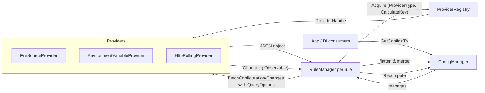

# Cocoar.Configuration — Architecture & Status (Last Updated: 2025-09-15)

This document captures the current design, behavior, and implementation details to onboard quickly and to guide future work. It has been synchronized against the codebase as of 2025-09-15.

## Goals

- Aggregate configuration from multiple sources into strongly-typed objects.
- Deterministic rule ordering: later rules override earlier ones (last-write-wins per key).
- Live updates: source changes trigger a full recompute; consumers get latest values on next retrieval.
- Simple DI integration for console/web apps.

## Key Concepts

- ConfigRule: a single step in the pipeline describing
  - ProviderType (e.g., File, Environment, HTTP)
  - ProviderOptions (instance options; define resource identity and lifetime)
  - QueryOptions (what to fetch/select from the provider)
  - Concrete Type (the configuration POCO type produced)
  - Options (UseWhen, Required)
- Factory deferral: rule factories (instance/query option factories) are stored, not executed at rule construction time. They are invoked during recompute, enabling dynamic dependencies between rules.
- Providers
  - Implement `FetchConfigurationAsync(query)` and `Changes(query)`.
  - Startup behavior: `ConfigManager` executes an initial synchronous recompute invoking `FetchConfigurationAsync` for every active rule (honoring `UseWhen`). There is no initial emission from any provider's `Changes()` stream; recomputes after startup are triggered solely by change notifications.
  - Instance options live in the provider constructor; queries are per-call to allow reuse and dynamic binding.
  - Reuse: Providers are pooled by a provider-specific identity key (see Provider Reuse & Identity Keys section).
- Dynamic dependencies: during recompute, later rules can read earlier outputs via ConfigManager (e.g., GetRequiredConfig<T>), thanks to a working snapshot that is updated after each rule’s merge.
- Architecture diagram
  - See the visual diagram in `architecture.drawio` (open with diagrams.net/draw.io).
  - Quick Mermaid overview:


- ConfigManager
  - Holds the ordered list of rules and materializes a distinct `RuleManager` per rule.
  - Recompute: merges flattened JSON objects per contract/concrete type; later rules win per key (last-write-wins).
  - Change handling: any provider change triggers a full, locked recompute of all active rules (coarse-grained lock; no parallel recomputes). Recompute is not cancelled once started.
  - Required rule: failure aborts the entire recompute (exception thrown). Optional rule: failure is logged (warning) and its contribution is skipped.

### Recompute & working snapshot

- Full recompute: on any change notification, all rules are re-evaluated in order; outputs are merged last-write-wins per key.
- Working snapshot: while recompute is in progress, ConfigManager exposes an in-progress snapshot so that a later rule’s factory or provider options can read values emitted by earlier rules in the same recompute. After recompute finishes, the working snapshot is cleared and the final snapshot is swapped in atomically.

## Current Providers

 - FileSourceProvider
  - Options: `FileSourceProviderOptions(directory, debounceTime?)`
  - Query: `FileSourceProviderQueryOptions(filename, debounceTime?)` (query-level debounce throttles the emission stream for that rule only). Use rule-level `.Select("Section:Sub")` to extract subsections.
  - Behavior: directory watcher; caches last parsed JSON; emits after FS events. Errors during change handling yield empty JSON. Missing required file throws during recompute.
- EnvironmentVariableProvider
  - Options: `EnvironmentVariableProviderOptions(environmentPrefix?)`
  - Query: `EnvironmentVariableProviderQueryOptions(environmentPrefix?)`
  - Behavior: snapshot read only; no change stream.
- HttpPollingProvider
  - Options: `HttpPollingProviderOptions(baseAddress?, pollInterval?=5s, handler?)`
  - Query: `HttpPollingProviderQueryOptions(urlPathOrAbsolute, headers?)`
  - Behavior: polls and emits when payload JSON changes. Use `.Select(...)` at rule level to narrow the subtree.
- MicrosoftConfigurationSourceProvider (Adapter)
  - Query: `MicrosoftConfigurationSourceProviderQueryOptions(configurationPrefix?)`
- StaticJsonProvider
  - Supplies static JSON; never changes.

### Provider Reuse & Identity Keys

| Provider | Identity Key Strategy | Notes |
|----------|-----------------------|-------|
| FileSourceProvider | Absolute directory path | Debounce differences do not create new provider instances. |
| EnvironmentVariableProvider | Constant ("Environment:Global") | One shared instance regardless of prefix per rule. |
| HttpPollingProvider | Serialized provider options (baseAddress + handler identity) | Separate instance per distinct base address / handler. |
| MicrosoftConfigurationSourceProvider | `Source.GetType().FullName|BasePath|Identity` | Distinct sources/base paths create new instances. |
| StaticJsonProvider | Constant ("Static") | Value differences handled at rule/query level; provider reused. |

Query-level subscription keys are based on serialization of the entire query object; any change to query options forces resubscription.

## Merge Semantics

- Each provider returns a JSON object. Objects are flattened into colon-separated keys (e.g., SectionA:Enabled).
- A rule's output overrides existing keys for its config type.
- After all rules, unflatten back to a JSON object and deserialize to the desired type.
- Arrays: not merged; only object graphs are considered in the flatten/unflatten process.

## DI & Access

- ServiceCollection extension registers ConfigManager as singleton and exposes requested config contracts (and implementation types when declared). Registration uses GetRequiredConfig to ensure mandatory presence at startup.
- Supports different service lifetimes (Singleton, Scoped, Transient) and optional service keys for multi-tenant scenarios.
- Access via ConfigManager:
  - GetConfig<T>() / GetConfig(Type): returns current snapshot or null when missing.
  - GetRequiredConfig<T>() / GetRequiredConfig(Type): throws InvalidOperationException when missing.
  - TryGetConfig<T>(out T?) / TryGetConfig(Type, out object?): convenience for null-safe checks.

## Logging & Analysis

- Uses standard `ILogger` (no custom abstraction) for recompute lifecycle, required/optional rule failures, and change-trigger errors.
- `ConfigurationAnalyzer` (invoked once during `Initialize`) currently performs lightweight informational logging (counts, static-vs-dynamic mix heuristic) and does not build a dependency graph or detect cycles; prior wording implying deeper analysis has been clarified.

## Error Handling

- Required rules fail recompute with an InvalidOperationException (wrapped original exception).
- Optional rules are skipped on error; recompute proceeds.
- Change streams attempt to avoid faulting (File: swallow IO in Changes; HTTP: emit only on success and when changed).

## Known Trade-offs & Future Improvements

- Recompute scope: full recompute is simple and correct but not minimal.
  - Future: partial recompute from the changed rule to the end.
- Provider reuse across recomputes:
  - Implemented via RuleManager: providers are reused when instance options key is unchanged; subscriptions are refreshed when query key changes.
  - Optional IDisposable disposal hooks are honored when a provider is replaced.
- Arrays merging: consider strategies (overwrite/append/custom policy).
- Naming consistency and nullability cleanliness.
- Provider contract variants:
  - Optional BoundProvider layer to pin a provider to a specific query for stricter API (parameterless GetValue/Changes) without losing reuse.
- Cycle detection/diagnostics for dynamic dependencies: warn or trace potential cycles; currently not enforced.

## Testing Status

- Tests exist for core providers (File, Environment, HTTP), Microsoft adapter integration, dynamic dependency scenarios, and static seeding. (Exact counts omitted to avoid staleness; run the test suite for current status.)

## Usage Examples

- File + Env + HTTP overlay with DI:

```csharp
services.AddCocoarConfiguration([
  Rule.From.File(_ => FileSourceRuleOptions.FromFilePath("./config.json")).Select("SectionA").For<MySectionSettings>(),
  Rule.From.Environment(_ => new EnvironmentVariableRuleOptions("MYAPP_")).For<MySectionSettings>(),
  Rule.From.HttpPolling(cfg => new HttpPollingRuleOptions(
    urlPathOrAbsolute: "/v1/settings",
    baseAddress: "https://config.example.com",
    pollInterval: TimeSpan.FromSeconds(10)
  )).For<MySectionSettings>()
]);
```

## Quick Reference (Contracts)

- ConfigRuleOptions (record): Required (bool), UseWhen (Func<bool>?), SelectPath (string?), MountPath (string?)
- Rule-level selection & mounting: `.Select("Section:Sub")` then `.MountAt("Container")` (optional). Pipeline: Fetch → Select → Mount → Merge.
- File: `FileSourceProviderOptions(dir, debounceTime?)`, `FileSourceProviderQueryOptions(filename, debounceTime?)`
- Environment: `EnvironmentVariableProviderOptions(environmentPrefix?)`, `EnvironmentVariableProviderQueryOptions(environmentPrefix?)`
- HTTP: `HttpPollingProviderOptions(baseAddress?, pollInterval?=5s, handler?)`, `HttpPollingProviderQueryOptions(urlPathOrAbsolute, headers?)`
- Static: `StaticJsonProviderOptions(jsonValue)`

### Migration Note (Breaking Change)

Before (legacy configurationPath + targetPath in provider/query options):
```csharp
Rule.From.File(_ => FileSourceRuleOptions.FromFilePath("settings.json")).Select("SectionA")
    .For<MySettings>()
    .Build();
```
After (rule-level select + mount):
```csharp
Rule.From.File(_ => FileSourceRuleOptions.FromFilePath("settings.json"))
    .Select("SectionA")
    .MountAt("My:Mounted")
    .For<MySettings>()
    .Build();
```
Benefits: simpler queries; centralized Fetch → Select → Mount → Merge enabling future partial recompute.

### Incremental Recompute (Overview)

The configuration pipeline now supports incremental recomputation:

- Provider change events are selection-hash gated: if the selected subtree (after `.Select`) is unchanged, no recompute is scheduled.
- When changes occur, only the suffix of rules from the earliest changed index is recomputed (providers refetched); the prefix is reconstructed from stored per-rule flattened contributions without provider calls.
- Cancellation: a new earlier-index change arriving mid-pass cancels the in-flight recompute and restarts from the new earliest index, ensuring minimal redundant work.
- Debounce refinement: first change executes promptly (configurable initial delay) and subsequent rapid changes are coalesced in a short trailing window, reducing latency for isolated updates while collapsing bursts.
- Deletions: if a later fetch omits keys previously contributed by that rule, those keys are removed from the merged configuration unless overridden by later rules.

Future optimizations (excluded from this commit) include fine-grained skipping inside the recomputed suffix and performance benchmarks to guide hash algorithm selection.

### Static Rule Set (No Runtime Add/Remove)

The set of configuration rules is intentionally immutable after `ConfigManager.Initialize()`. Dynamic
add/remove (structural mutation) was evaluated and deferred because it would:

- Complicate incremental recompute (earliest-index stability, cancellation restarts)
- Require subscription & provider handle churn for little practical gain
- Increase locking complexity and potential for subtle race conditions

Instead, conditional participation is handled via `UseWhen` predicates. When `UseWhen` evaluates to
false, the rule is skipped and its previous contribution removed on the next pass, achieving the
practical effect of a disabled rule without structural changes. This keeps ordering deterministic and
guarantees predictable incremental recompute behavior. Support for true dynamic structural mutation
can be revisited if a compelling scenario emerges.

## Version

- Last synchronized with code: 2025-09-15